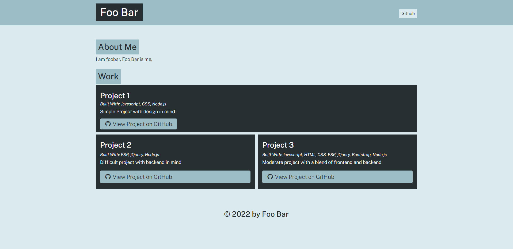

# Portfolio Generator

## Requirements
You must have Node.JS installed to use this utility.
\
https://nodejs.org/en/download/

## Description
This is an Node.JS app that generates the HTML and CSS of a portfolio. Populates porfolio data from a few simple command line prompts.

## Instructions
1. Download the repo to your local machine.
2. Open a command prompt and navigate to the repo folder.
3. Type in the command `npm install`.
4. Once the command finishes, type in `node app`.
5. Follow the prompts from the command line to fill in all your portfolio details.
6. Find your outputed HTML and CSS in the "dist" folder.

## Example Finished Site

